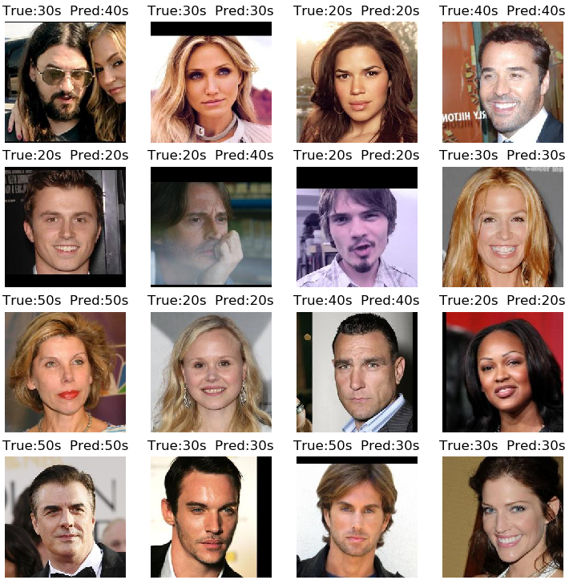
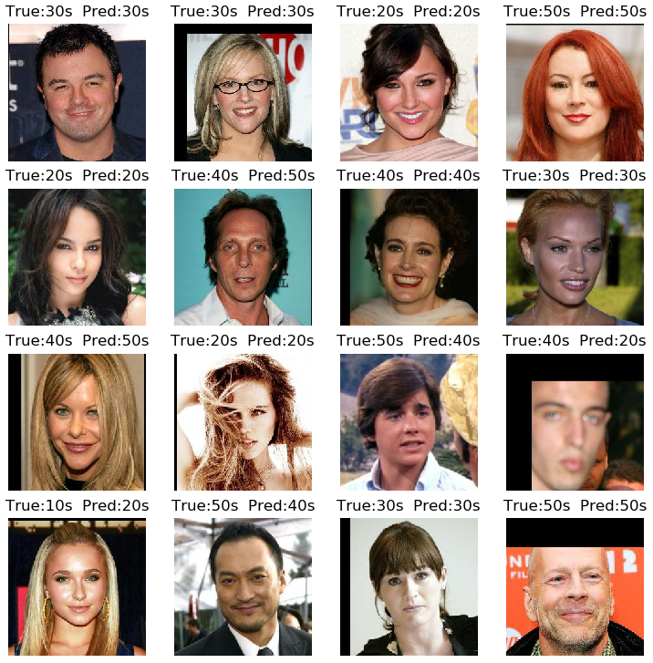

## Face age classification
Resnet50 based simple deep learning model to classifiy face age on dataset Cross-Age Celebrity Dataset (CACD)

<br/>

## Dependencies
* [Python 3.5+](https://www.continuum.io/downloads)
* [PyTorch 0.4.0](http://pytorch.org/)

<br/>

## Usage

### 1. Cloning the repository
```bash
$ git clone https://github.com/HayeonLee/face-age-classification.git
$ cd face-age-classification/
```

### 2. Downloading the dataset
Download [the Cross-Age Celebrity Dataset (CACD) dataset](http://bcsiriuschen.github.io/CARC/)

### 3. Training
```bash
$ python main.py --mode test --image_dir cacd2000_224 --crop_size 224 --image_size 224 \
                 --gpu_ids 0 --batch_size 64 --pretrain True --log_dir cacd2000_cls/logs \
                 --model_save_dir cacd2000_cls/models --result_dir cacd2000_cls/results
```

### 4. Pretrained model
Download a pretrained model checkpoint to test the model
```bash
$ mv 104000.ckpt cacd2000_cls/models/
```

### 5. Testing
Test your own model

```bash
$ python main.py --mode test --image_dir cacd2000_224 --crop_size 224 --image_size 224 \
                 --gpu_ids 0 --batch_size 64 --pretrain False --log_dir YOURFOLDER/logs \
                 --model_save_dir YOURFOLDER/models --result_dir YOURFOLDER/results \
                 --resume_iters CHECKPOINTSFILE
```

Test pretrained model using chekpoints
```bash
$ python main.py --mode test --image_dir cacd2000_224 --crop_size 224 --image_size 224 \
                 --gpu_ids 0 --batch_size 64 --pretrain False --log_dir cacd2000_cls/logs \
                 --model_save_dir cacd2000_cls/models --result_dir cacd2000_cls/results \
                 --resume_iters 104000
```

<br/>

## Results

<p align="center"></p>

<p align="center"></p>


<br/>

## Reference
I refer code and readme template of [StarGAN](https://github.com/yunjey/StarGAN.git)<br/>
[StarGAN: Unified Generative Adversarial Networks for Multi-Domain Image-to-Image Translation](https://arxiv.org/abs/1711.09020) <br/>
Yunjey Choi et al. IEEE Conference on Computer Vision and Pattern Recognition, 2018

<br/>
